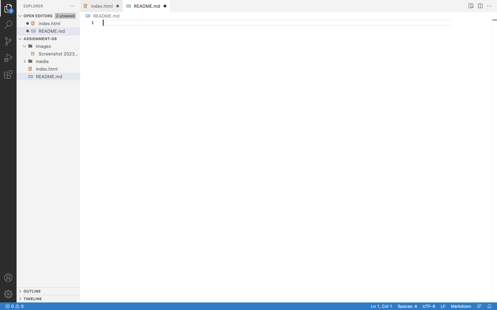

An affordance is how the design aspect of the object suggests how the object will/could be used.

When it comes to using third-party hosting/services some advantages are the fact that you can host large and high quality versions of files, they are ideal for both video and audio files, and they handel compatibility and encoding, along with other factors, without you having to do any of the work. The disadvantages are that they are not the most ideal fo rimage files, you must use licenced materials, and they can become costly to upgrade your storage or services. 
