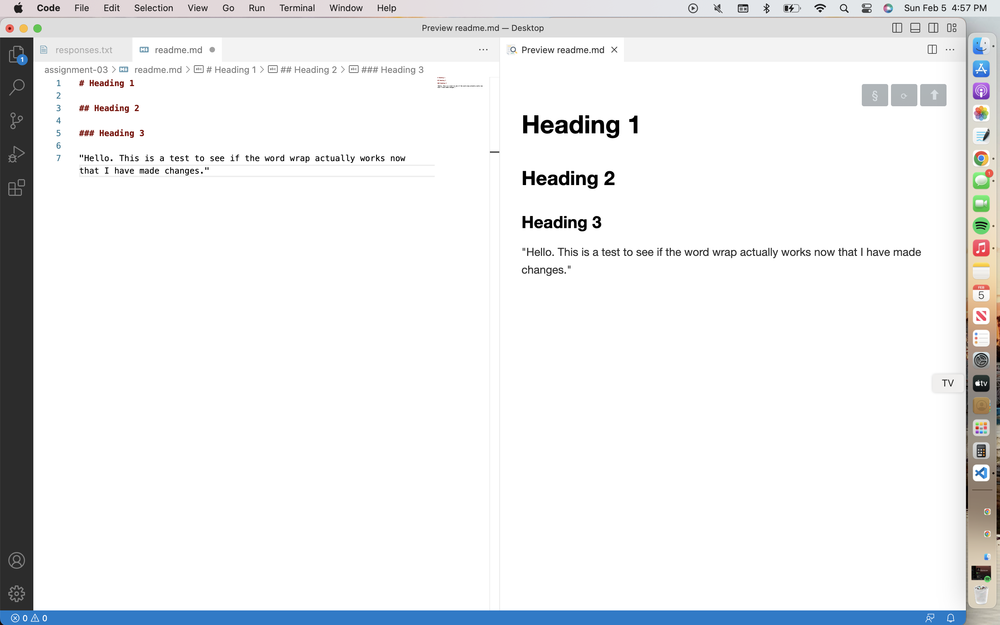

# Heading 1 

I have learned exactly what a URL and cookies are, what to think about when visiting different websites, and how to make certian aspects pop up when creating sites such as headings and links.
[my file](https://github.com/delaneyogle/MART341-WebDesign/blob/main/assignment-03/images/responses.txt) 

 
